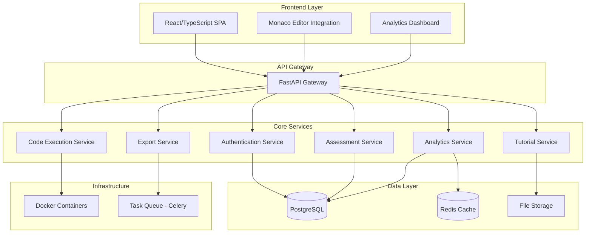

# Design Document

## Overview

The Online Assessment Platform is a full-stack web application built with Python (FastAPI/Django) backend and React/TypeScript frontend. The system integrates Monaco Editor (VS Code's editor) for coding assessments, implements secure code execution in Docker containers, and provides comprehensive analytics with multi-format export capabilities. The architecture follows microservices principles with separate services for authentication, assessment management, code execution, and analytics.

## Architecture

### High-Level Architecture



### Technology Stack

**Backend:**
- **Framework:** FastAPI (for high performance and automatic API documentation)
- **Database:** PostgreSQL (for complex relational data and ACID compliance)
- **Cache:** Redis (for session management and performance optimization)
- **Task Queue:** Celery with Redis broker (for background tasks like exports)
- **Code Execution:** Docker containers with resource limits
- **Authentication:** JWT tokens with refresh token rotation

**Frontend:**
- **Framework:** React 18 with TypeScript
- **State Management:** Redux Toolkit with RTK Query
- **Editor:** Monaco Editor (VS Code editor component)
- **UI Components:** Material-UI (MUI) or Ant Design
- **Charts:** Chart.js or D3.js for analytics visualization
- **Build Tool:** Vite for fast development and building

**Infrastructure:**
- **Containerization:** Docker and Docker Compose
- **Reverse Proxy:** Nginx
- **File Storage:** Local filesystem or AWS S3
- **Monitoring:** Prometheus + Grafana
- **Logging:** Structured logging with ELK stack

## Components and Interfaces

### 1. Authentication Service

**Responsibilities:**
- User registration, login, and session management
- Role-based access control (RBAC)
- JWT token generation and validation
- Password reset and email verification

**Key Interfaces:**
```python
class AuthService:
    def register_user(self, user_data: UserRegistration) -> User
    def authenticate_user(self, credentials: LoginCredentials) -> AuthToken
    def verify_token(self, token: str) -> TokenPayload
    def refresh_token(self, refresh_token: str) -> AuthToken
    def reset_password(self, email: str) -> bool
```

**Database Schema:**
- Users table (id, email, password_hash, role, created_at, verified)
- Sessions table (token_id, user_id, expires_at, refresh_token)
- Roles table (id, name, permissions)

### 2. Assessment Service

**Responsibilities:**
- CRUD operations for assessments and questions
- Assessment configuration and scheduling
- Question type management (coding, MCQ, descriptive)
- Student assessment attempts tracking

**Key Interfaces:**
```python
class AssessmentService:
    def create_assessment(self, assessment_data: AssessmentCreate) -> Assessment
    def add_question(self, assessment_id: int, question: Question) -> Question
    def start_assessment(self, user_id: int, assessment_id: int) -> AssessmentAttempt
    def submit_answer(self, attempt_id: int, question_id: int, answer: Answer) -> bool
    def finalize_assessment(self, attempt_id: int) -> AssessmentResult
```

**Database Schema:**
- Assessments table (id, title, description, time_limit, created_by, settings)
- Questions table (id, assessment_id, type, content, test_cases, rubric)
- Attempts table (id, user_id, assessment_id, started_at, submitted_at, status)
- Answers table (id, attempt_id, question_id, content, score, feedback)

### 3. Code Execution Service

**Responsibilities:**
- Secure code execution in isolated Docker containers
- Support for multiple programming languages
- Resource limitation and timeout management
- Test case execution and result compilation

**Key Interfaces:**
```python
class CodeExecutionService:
    def execute_code(self, code: str, language: str, test_cases: List[TestCase]) -> ExecutionResult
    def validate_syntax(self, code: str, language: str) -> ValidationResult
    def get_supported_languages(self) -> List[Language]
```

**Docker Configuration:**
- Separate containers for each supported language
- Resource limits (CPU, memory, execution time)
- Network isolation and restricted file system access
- Custom images with pre-installed compilers/interpreters

### 4. Analytics Service

**Responsibilities:**
- Performance analytics and reporting
- Statistical analysis of assessment results
- Grade distribution and trend analysis
- Individual and class-level insights

**Key Interfaces:**
```python
class AnalyticsService:
    def generate_assessment_report(self, assessment_id: int) -> AssessmentReport
    def get_student_performance(self, user_id: int) -> StudentPerformance
    def calculate_statistics(self, assessment_id: int) -> AssessmentStatistics
    def generate_trends(self, timeframe: DateRange) -> TrendAnalysis
```

### 5. Export Service

**Responsibilities:**
- Multi-format export generation (PDF, Excel, CSV, JSON)
- Asynchronous report generation
- Template-based report formatting
- Bulk export capabilities

**Key Interfaces:**
```python
class ExportService:
    def export_results(self, assessment_id: int, format: ExportFormat) -> ExportTask
    def get_export_status(self, task_id: str) -> ExportStatus
    def download_export(self, task_id: str) -> FileResponse
```

### 6. Tutorial Service

**Responsibilities:**
- Programming language documentation management
- Search and indexing of tutorial content
- Version control for documentation updates
- User bookmark and progress tracking

**Key Interfaces:**
```python
class TutorialService:
    def get_language_docs(self, language: str) -> Documentation
    def search_content(self, query: str, language: str) -> SearchResults
    def bookmark_section(self, user_id: int, section_id: str) -> bool
    def track_progress(self, user_id: int, section_id: str) -> Progress
```

## Data Models

### Core Entities

```python
# User Management
class User(BaseModel):
    id: int
    email: str
    role: UserRole
    created_at: datetime
    last_login: Optional[datetime]

class UserRole(Enum):
    STUDENT = "student"
    INSTRUCTOR = "instructor"
    ADMIN = "admin"

# Assessment Models
class Assessment(BaseModel):
    id: int
    title: str
    description: str
    time_limit: Optional[int]
    max_attempts: int
    start_time: Optional[datetime]
    end_time: Optional[datetime]
    created_by: int
    settings: AssessmentSettings

class Question(BaseModel):
    id: int
    assessment_id: int
    type: QuestionType
    title: str
    content: str
    points: int
    order: int
    metadata: Dict[str, Any]

class QuestionType(Enum):
    CODING = "coding"
    MCQ = "mcq"
    DESCRIPTIVE = "descriptive"

# Coding Question Specific
class CodingQuestion(Question):
    language: str
    starter_code: str
    test_cases: List[TestCase]
    resource_limits: ResourceLimits

class TestCase(BaseModel):
    input: str
    expected_output: str
    is_hidden: bool
    weight: float

# Assessment Attempts
class AssessmentAttempt(BaseModel):
    id: int
    user_id: int
    assessment_id: int
    started_at: datetime
    submitted_at: Optional[datetime]
    status: AttemptStatus
    total_score: Optional[float]

class Answer(BaseModel):
    id: int
    attempt_id: int
    question_id: int
    content: str
    score: Optional[float]
    feedback: Optional[str]
    submitted_at: datetime
```

## Error Handling

### Error Categories

1. **Authentication Errors**
   - Invalid credentials
   - Expired tokens
   - Insufficient permissions

2. **Validation Errors**
   - Invalid input data
   - Missing required fields
   - Business rule violations

3. **Execution Errors**
   - Code compilation failures
   - Runtime exceptions
   - Resource limit exceeded

4. **System Errors**
   - Database connection issues
   - External service failures
   - File system errors

### Error Response Format

```python
class ErrorResponse(BaseModel):
    error_code: str
    message: str
    details: Optional[Dict[str, Any]]
    timestamp: datetime
    request_id: str

# Example error responses
{
    "error_code": "INVALID_CREDENTIALS",
    "message": "Invalid email or password",
    "details": null,
    "timestamp": "2024-01-15T10:30:00Z",
    "request_id": "req_123456"
}
```

### Error Handling Strategy

- **Global Exception Handler:** Catch and format all unhandled exceptions
- **Validation Middleware:** Validate request data before processing
- **Circuit Breaker:** Prevent cascade failures in microservices
- **Retry Logic:** Automatic retry for transient failures
- **Logging:** Comprehensive error logging with correlation IDs

## Testing Strategy

### Testing Pyramid

1. **Unit Tests (70%)**
   - Service layer logic
   - Data model validation
   - Utility functions
   - Business rule enforcement

2. **Integration Tests (20%)**
   - API endpoint testing
   - Database operations
   - External service integration
   - Code execution pipeline

3. **End-to-End Tests (10%)**
   - Complete user workflows
   - Cross-service communication
   - UI interaction testing
   - Performance validation

### Testing Tools and Frameworks

**Backend Testing:**
- **pytest:** Primary testing framework
- **pytest-asyncio:** Async test support
- **httpx:** HTTP client for API testing
- **factory_boy:** Test data generation
- **pytest-cov:** Code coverage reporting

**Frontend Testing:**
- **Jest:** Unit testing framework
- **React Testing Library:** Component testing
- **Cypress:** End-to-end testing
- **MSW:** API mocking for tests

**Code Execution Testing:**
- **Docker test containers:** Isolated execution environment
- **Test case validation:** Automated test case verification
- **Security testing:** Container escape prevention
- **Performance testing:** Resource usage validation

### Continuous Integration

```yaml
# GitHub Actions workflow example
name: CI/CD Pipeline
on: [push, pull_request]

jobs:
  test:
    runs-on: ubuntu-latest
    services:
      postgres:
        image: postgres:14
        env:
          POSTGRES_PASSWORD: test
      redis:
        image: redis:7
    
    steps:
      - uses: actions/checkout@v3
      - name: Set up Python
        uses: actions/setup-python@v4
        with:
          python-version: '3.11'
      
      - name: Install dependencies
        run: |
          pip install -r requirements.txt
          pip install -r requirements-dev.txt
      
      - name: Run tests
        run: |
          pytest --cov=app --cov-report=xml
      
      - name: Run security checks
        run: |
          bandit -r app/
          safety check
```

### Security Testing

- **Static Analysis:** Code security scanning with Bandit
- **Dependency Scanning:** Vulnerability detection with Safety
- **Container Security:** Docker image scanning
- **Penetration Testing:** Regular security assessments
- **Code Execution Security:** Sandbox escape testing

This design provides a robust, scalable foundation for the online assessment platform with proper separation of concerns, security considerations, and comprehensive testing strategies.